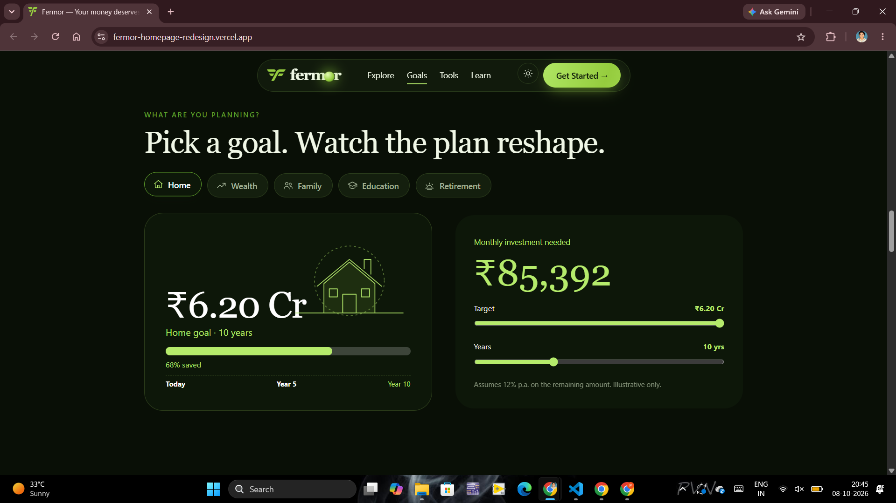
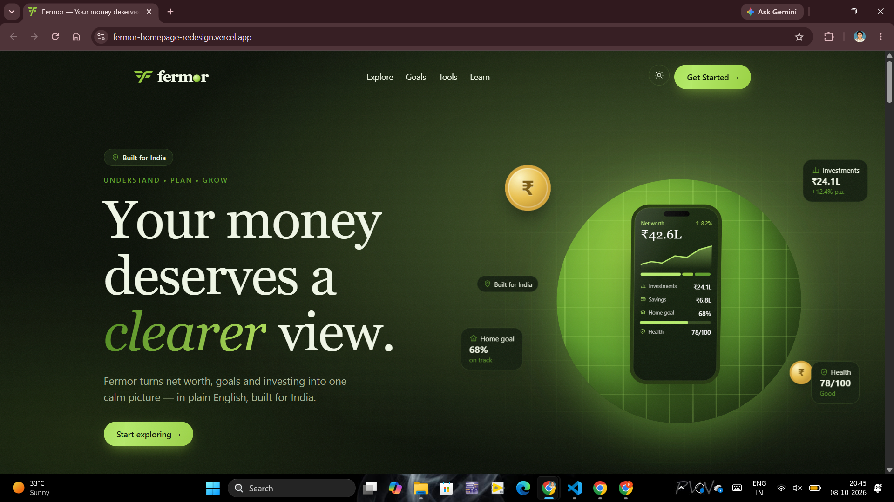
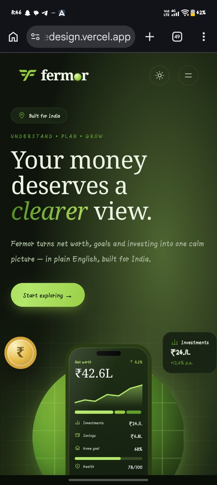
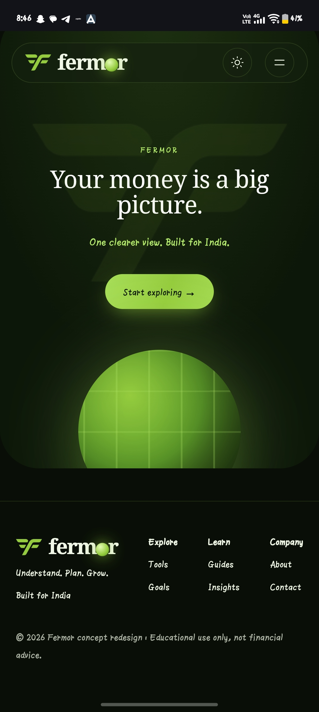

# Fermor — Homepage Redesign

A modern, interactive homepage redesign concept for **Fermor**, focused on making financial decisions easier to understand through visual storytelling, interactive tools, and a premium fintech experience.

## 🔗 Links

- **Live Demo:** https://fermor-homepage-redesign.vercel.app/
- **GitHub:** https://github.com/viswanikhitha11/fermor-homepage-redesign

---

## 🎯 Project Overview

This project redesigns the Fermor homepage with a focus on:

- Clear financial storytelling
- Interactive financial experiences
- Premium visual design
- Responsive layouts
- Subtle motion and micro-interactions
- Simple and accessible user experience

Instead of presenting financial features as traditional static cards, the homepage turns important financial concepts into interactive sections.

---

## ✨ Key Features

### Interactive Hero

- Premium financial dashboard visual
- Animated financial data
- Mouse-based interaction
- Floating visual elements
- Responsive hero experience

### Financial Snapshot

A visual overview of:

- Net worth
- Investments
- Savings
- Goal progress
- Financial position

### Financial Health Score

Interactive financial health visualization with:

- Overall health score
- Savings status
- Debt status
- Protection status
- Investment status
- Dynamic score interaction

### Goal Planner

Users can explore different financial goals:

- Buy a Home
- Build Wealth
- Protect Family
- Education
- Retirement

The selected goal dynamically updates the target, timeline, progress and supporting information.

### Financial Tools

Interactive financial tools including:

- SIP & Lumpsum
- EMI & Home Loan
- Income Tax
- NPS, PPF & EPF

The SIP calculator provides an interactive monthly investment projection.

### Investment Playground

A visual comparison of different investment categories based on illustrative:

- Returns
- Risk levels
- Investment types

### Future Wealth Projection

An interactive timeline allows users to change the investment horizon and view an illustrative future wealth projection.

### Financial Insights

An editorial-style section covering topics related to:

- Investing
- Tax & salary
- Financial planning

### Light & Dark Theme

The application supports both light and dark visual themes using CSS design tokens.

### Responsive Design

The homepage is designed for:

- Desktop
- Laptop
- Tablet
- Mobile

---

## 🎨 Design Direction

The design follows a premium fintech visual language using Fermor's green identity.

### Color Palette

| Color | Usage |
|---|---|
| `#0B241B` | Forest green |
| `#2F7654` | Primary green |
| `#BCEFD0` | Mint accent |
| `#F7F8F4` | Light background |
| `#68776F` | Secondary text |

The interface uses minimal cards, clean typography, subtle borders, soft shadows and restrained animation.

---

## 🧠 Design Decisions

### Show, Don't Tell

Major sections are designed as interactions instead of static feature blocks.

For example:

- Financial Health → interactive score
- Goals → interactive goal selection
- Tools → interactive calculator
- Planning → interactive timeline
- Investing → visual comparison

### Motion in Layers

Motion is intentionally subtle and follows a hierarchy:

1. Ambient movement
2. Hero interaction
3. Scroll-based reveals
4. Hover interactions
5. Data animations
6. User-driven interactions

Animations are used to improve storytelling rather than distract from the content.

### Mobile-First Thinking

The layout adapts content hierarchy and interactions for smaller screens rather than simply shrinking the desktop layout.

---

## 🛠️ Tech Stack

- **Next.js 14**
- **React**
- **JavaScript / JSX**
- **Next.js App Router**
- **CSS**
- **SVG**
- **IntersectionObserver**
- **CSS animations and transitions**

No UI component library was used.

---

## 📁 Project Structure

```text
fermor-homepage-redesign/
│
├── app/
│   ├── globals.css
│   ├── layout.jsx
│   └── page.jsx
│
├── components/
│   ├── Shell.jsx
│   └── Sections.jsx
│
├── public/
│   ├── logo.png
│   └── ...
│
├── package.json
├── package-lock.json
├── README.md
└── .gitignore

## 📸 Screenshots

### Desktop — Hero



### Interactive Financial Sections



### Mobile Responsive Design


